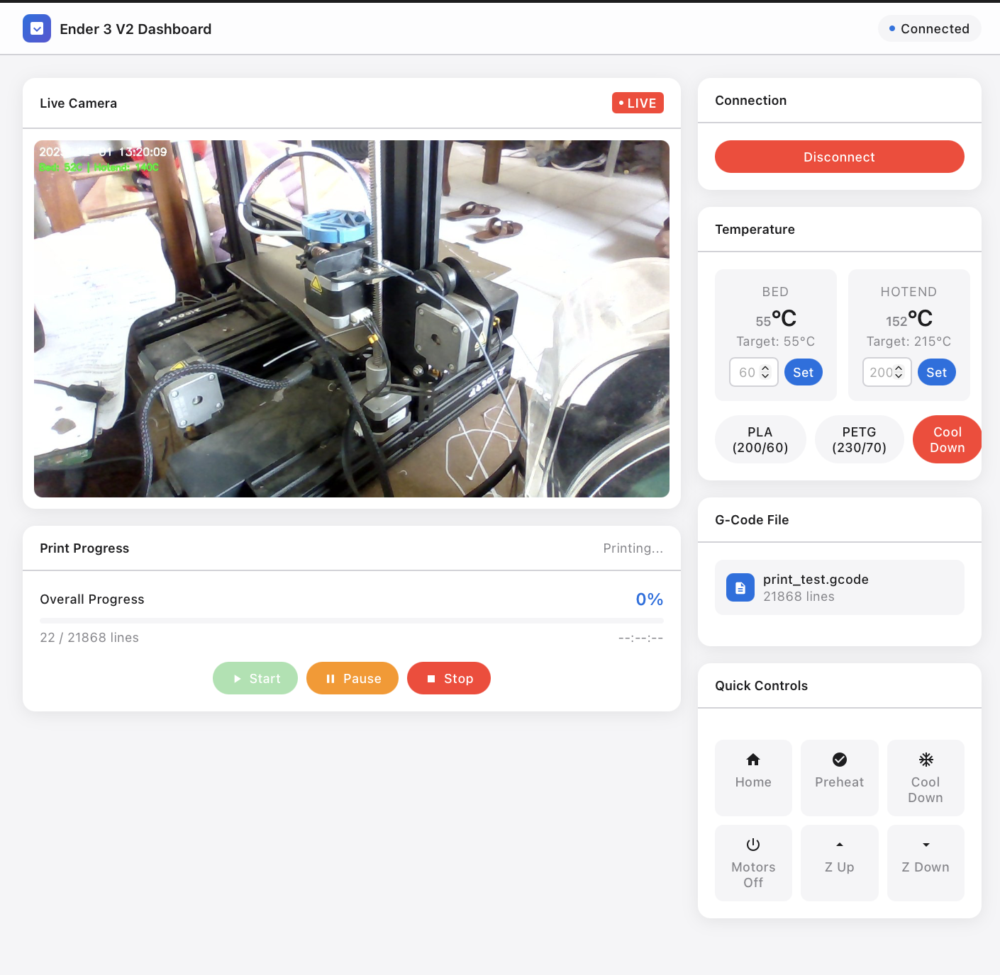

# Ender 3 V2 Ubuntu Dashboard

<div align="center">


**A sleek, Apple-inspired web dashboard for controlling your Ender 3 V2 3D printer from Ubuntu**

[Features](#features) • [Installation](#installation) • [Usage](#usage) • [FAQ](#faq) • [Contributing](#contributing)

</div>

---

## 📸 Dashboard Preview

<div align="center">

<p><em>Modern, responsive web interface with real-time camera feed and printer controls</em></p>
</div>

---

## ✨ Features

| Feature | Description |
|---------|-------------|
| 🎥 **Live Camera Feed** | Real-time webcam streaming with timestamp overlay |
| 🌡️ **Temperature Monitoring** | Live hotend and bed temperature with target display |
| 📁 **G-Code Upload** | Drag-and-drop file upload with instant parsing |
| ▶️ **Print Controls** | Start, pause, resume, and stop prints with one click |
| 🏠 **Quick Controls** | Home axes, preheat presets (PLA/PETG), motor control |
| 📊 **Progress Tracking** | Real-time progress bar with line count |
| 🔌 **Auto-Detection** | Automatic printer detection on USB ports |
| 🎨 **Modern UI** | Apple-style light theme with smooth animations |

---

## 🛠️ Installation

### Prerequisites

- Ubuntu 20.04+ (or any Linux distribution)
- Python 3.8+
- Ender 3 V2 connected via USB
- Webcam (optional, for live feed)

### Quick Start

```bash
# Clone the repository
git clone https://github.com/YasiruDEX/Ender-3-V2-Ubuntu.git
cd Ender-3-V2-Ubuntu

# Install dependencies
pip3 install flask flask-cors opencv-python pyserial --user

# Fix USB permissions (required for serial communication)
sudo usermod -a -G dialout $USER

# Disable brltty if CH340 is being hijacked (common issue)
sudo systemctl stop brltty-udev.service
sudo systemctl disable brltty-udev.service

# Start the dashboard
python3 app.py
```

### Access the Dashboard

Open your browser and navigate to:
```
http://localhost:3034
```

---

## 🚀 Usage

### 1. Connect Your Printer
- Plug in your Ender 3 V2 via USB
- Click **"Connect Printer"** in the dashboard
- The printer will be auto-detected on `/dev/ttyUSB0` or `/dev/ttyUSB1`

### 2. Upload G-Code
- Drag and drop your `.gcode` file onto the upload zone
- Or click to browse and select a file
- The file will be parsed and ready to print

### 3. Start Printing
- Set your temperatures using presets (PLA: 200°C/60°C, PETG: 230°C/70°C)
- Click **"Start"** to begin the print
- Monitor progress in real-time with the camera feed

### 4. Control Your Print
- **Pause**: Temporarily stop the print (retracts filament, raises Z)
- **Resume**: Continue from where you left off
- **Stop**: Emergency stop - turns off heaters and disables motors

---

## 📁 Project Structure

```
Ender-3-V2-Ubuntu/
├── app.py                  # Flask web server
├── printer_controller.py   # Serial communication & printer control
├── print_gcode.py          # Standalone G-code printing script
├── templates/
│   └── index.html          # Dashboard UI (Apple-style design)
├── uploads/                # Uploaded G-code files
├── gcodes/                 # Sample G-code files
└── docs/
    └── images/
        └── ui.png          # Dashboard screenshot
```

---

## ❓ FAQ

### Q: The printer is not being detected. What should I do?
**A:** This is usually caused by the `brltty` service hijacking the CH340 USB-to-serial chip. Run:
```bash
sudo systemctl stop brltty-udev.service
sudo systemctl disable brltty-udev.service
```
Then unplug and replug your printer.

### Q: I get a "Permission denied" error when connecting.
**A:** Add your user to the `dialout` group:
```bash
sudo usermod -a -G dialout $USER
```
Log out and log back in for changes to take effect.

### Q: The camera feed shows "Camera not available".
**A:** Make sure:
1. A webcam is connected and recognized (`ls /dev/video*`)
2. No other application is using the camera
3. OpenCV is installed: `pip3 install opencv-python`

### Q: How do I change the port number?
**A:** Edit `app.py` and change the port in the last line:
```python
app.run(host='0.0.0.0', port=3034, debug=False, threaded=True)
```

### Q: The stop button doesn't work during printing.
**A:** This was fixed in the latest version. The stop command now runs in a separate thread with proper flag handling. Make sure you have the latest code.

### Q: Can I use this with other Creality printers?
**A:** Yes! Any printer with Marlin firmware and a CH340/CH341 USB chip should work, including:
- Ender 3 / Ender 3 Pro / Ender 3 V2 Neo
- Ender 5 / Ender 5 Pro
- CR-10 series

### Q: How do I access the dashboard from another device?
**A:** The server binds to `0.0.0.0`, so you can access it from any device on your network:
```
http://<your-ubuntu-ip>:3034
```
Find your IP with `ip addr` or `hostname -I`.

---

## 🤝 Contributing

Contributions are welcome! Here's how you can help:

### Ways to Contribute

- 🐛 **Report Bugs**: Open an issue with detailed reproduction steps
- 💡 **Suggest Features**: Share your ideas for improvements
- 🔧 **Submit PRs**: Fix bugs or add new features
- 📖 **Improve Docs**: Help make the documentation clearer
- 🌍 **Translations**: Help translate the UI to other languages

### Development Setup

```bash
# Fork and clone
git clone https://github.com/<your-username>/Ender-3-V2-Ubuntu.git
cd Ender-3-V2-Ubuntu

# Create a branch
git checkout -b feature/your-feature-name

# Make changes and test
python3 app.py

# Commit and push
git add .
git commit -m "feat: add your feature description"
git push origin feature/your-feature-name

# Open a Pull Request on GitHub
```

### Code Style

- Follow PEP 8 for Python code
- Use meaningful variable and function names
- Add comments for complex logic
- Test your changes before submitting

---

## 👥 Collaborators

<table>
  <tr>
    <td align="center">
      <a href="https://github.com/YasiruDEX">
        <br />
        <sub><b>YasiruDEX</b></sub>
      </a><br />
      <sub>Project Lead</sub>
    </td>
    <!-- Add more collaborators here -->
  </tr>
</table>

**Want to be listed here?** Submit a meaningful contribution and you'll be added!

---

## 📄 License

This project is licensed under the MIT License - see the [LICENSE](LICENSE) file for details.

---

## 🙏 Acknowledgments

- [Marlin Firmware](https://marlinfw.org/) - The firmware that makes this possible
- [Flask](https://flask.palletsprojects.com/) - Lightweight web framework
- [OpenCV](https://opencv.org/) - Camera streaming
- [PySerial](https://pyserial.readthedocs.io/) - Serial communication

---

<div align="center">

**Made with ❤️ for the 3D printing community**

⭐ Star this repo if you found it helpful!

</div>
